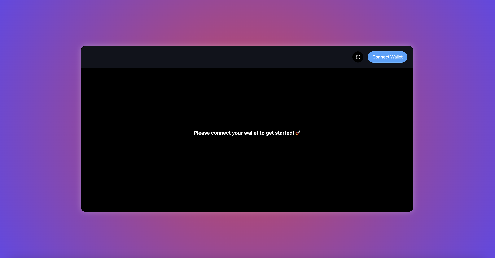

## Introduction 🚀



This project allows a user to input any 'Ethereum Mainnet Contract Address' and retrieve information & transaction history for it.
This is built to be a helpful project for people trying to get started building Web3 projects.

It is built using

```bash
- Typescript
- Next JS
- Web3Modal
- Ethers
```

## Overview Blog Post 🤖✉️

[https://garygeorge84.medium.com/create-a-web3-project-with-typescript-a5dcf27ee5e2](https://garygeorge84.medium.com/create-a-web3-project-with-typescript-a5dcf27ee5e2)

## Demo URL 🖥️

[https://web3-contract-explorer-ruby.vercel.app](https://web3-contract-explorer-ruby.vercel.app)

## Running locally 🚀

First, run the development server:

```bash
npm i
npm run dev
```

Then open [http://localhost:3000](http://localhost:3000) with your browser to see the result.

## Tests 🧪

Some example Testing Library specs have been written:

```bash
npm run test
```
